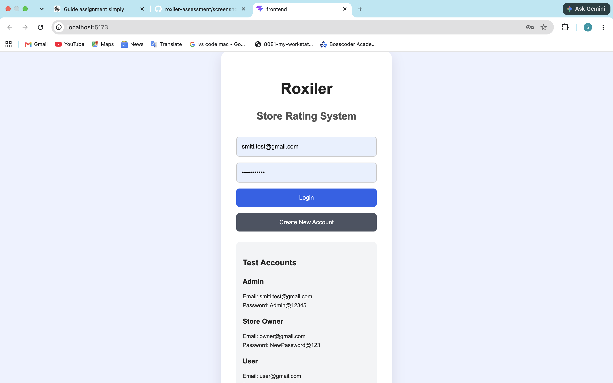
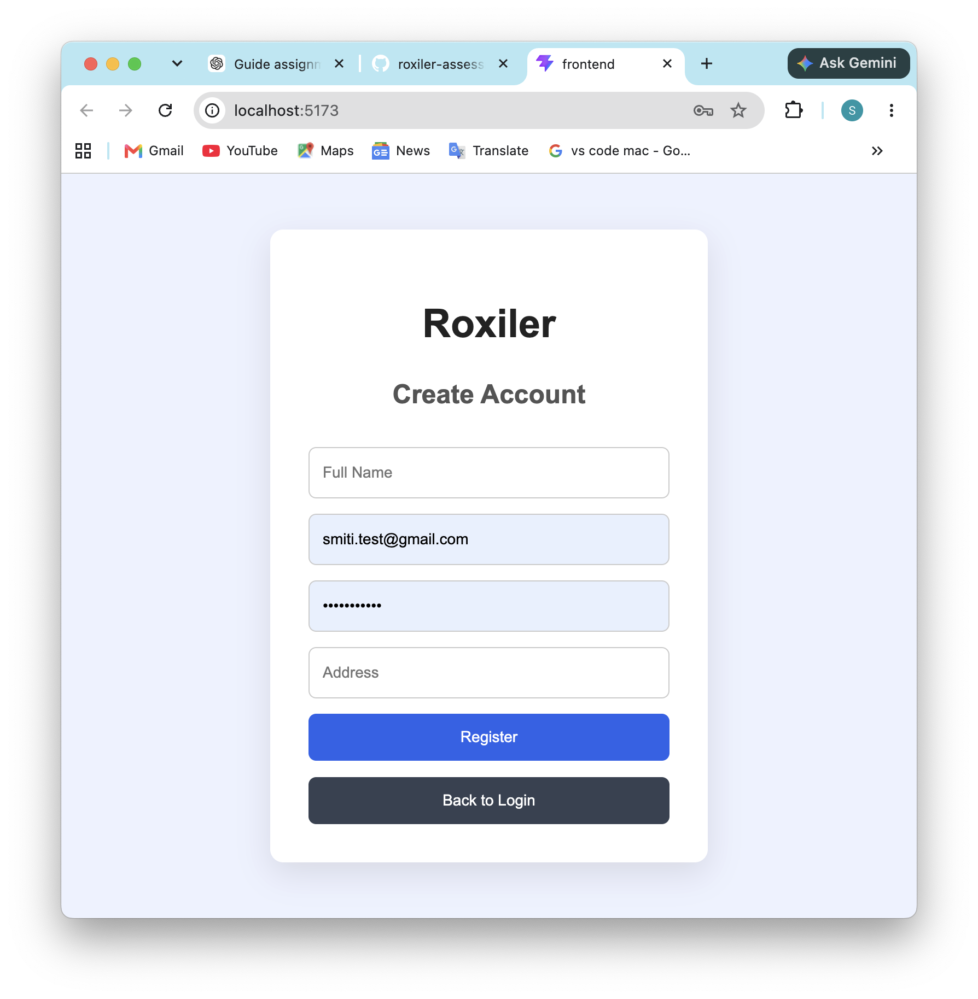
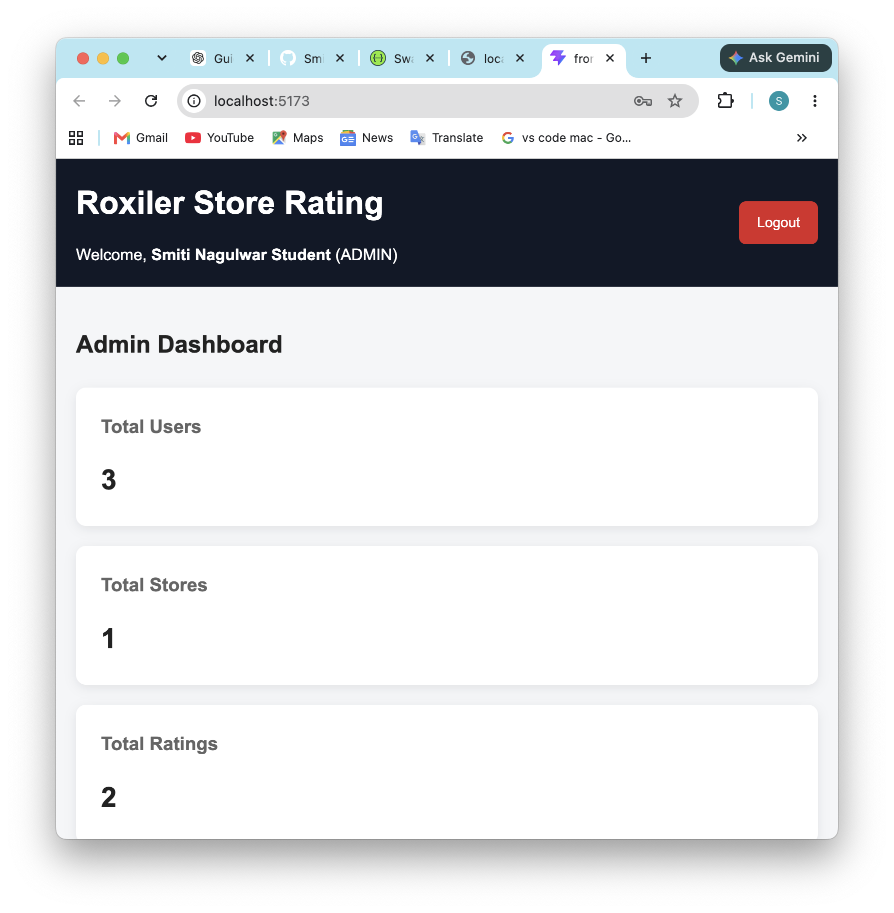
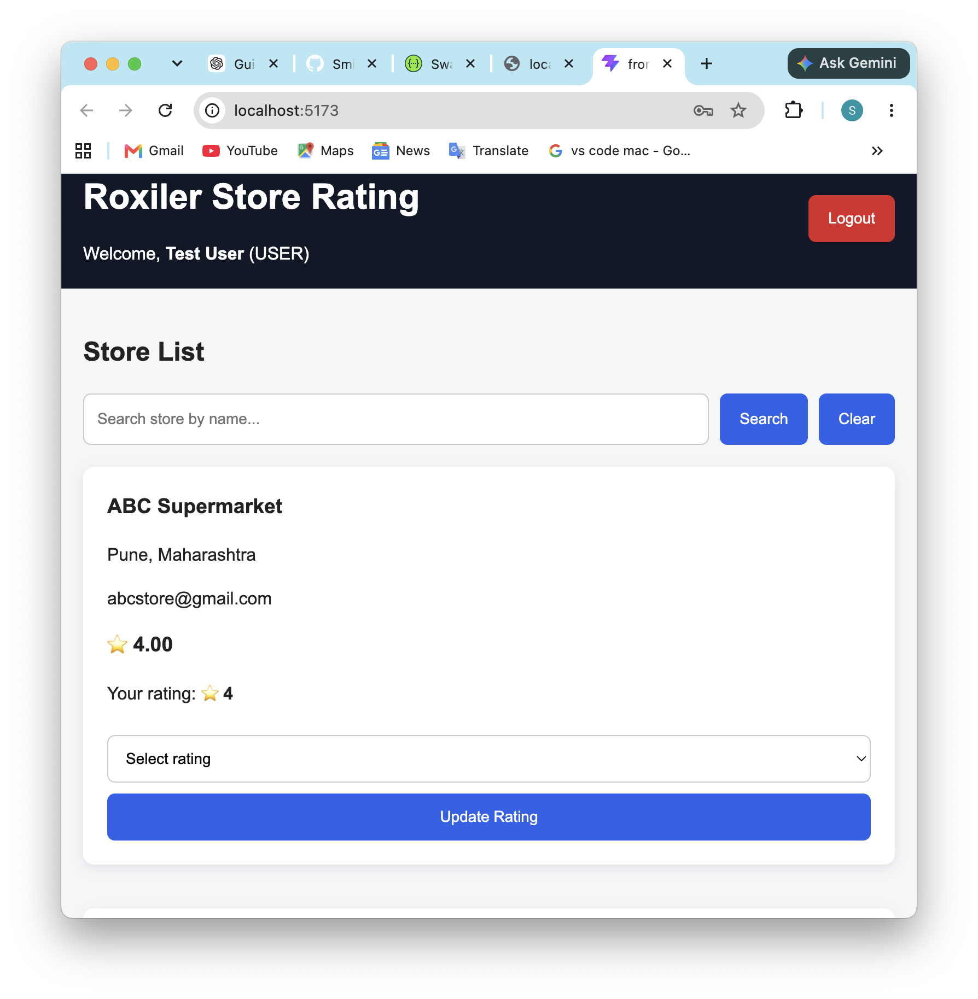
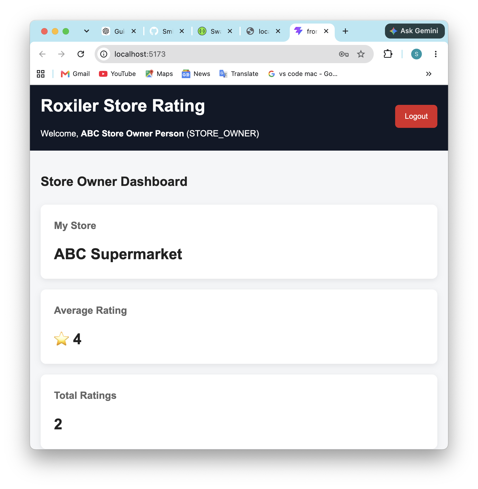

# Roxiler Store Rating System

A full-stack store rating application developed for the Roxiler Systems Full Stack Developer assessment.

## Tech Stack

### Frontend
- React
- CSS
- Vite

### Backend
- Node.js
- Express.js
- PostgreSQL
- JWT Authentication
- bcrypt
- Swagger

## User Roles

### Admin
- View dashboard
- Create users
- Create stores
- View users
- View stores
- View ratings

### Normal User
- Login
- View stores
- Search stores
- Submit ratings
- Modify ratings
- Change password

### Store Owner
- View store dashboard
- View average rating
- View users who rated the store
- Change password

## Running the Project

### Backend

```bash
cd backend
npm install
node server.js

## Screenshots

### Login Page


### Registration Page


### Admin Dashboard


### User Dashboard


### Store Owner Dashboard

